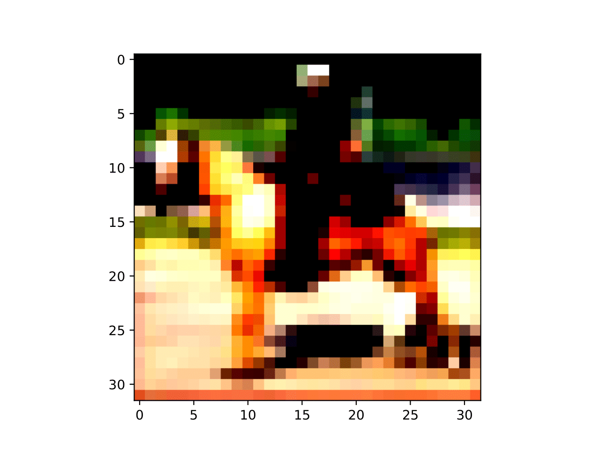
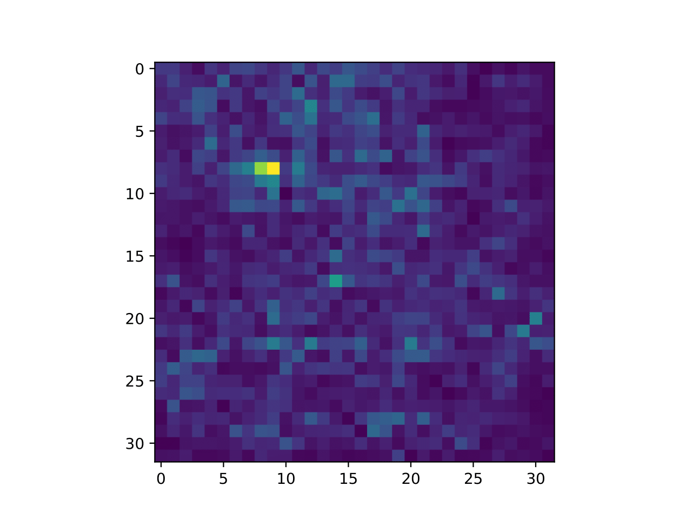
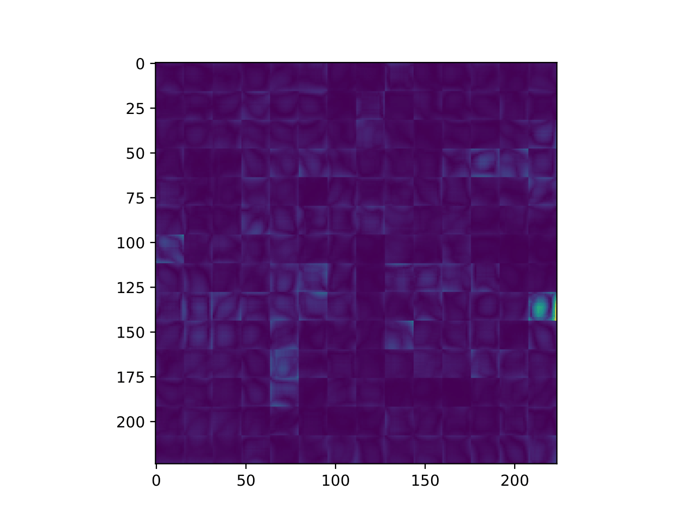

# DSBA Pretraining CV
This is DSBA pretraining CV code.
This repository includes ResNet&ViT training code on CIFAR10/100 and TinyImagenet.

# Results
- SGD with 0.1 lr

|Model|CIFAR10|CIFAR100|TinyImagenet|
|---|---|---|---|
|ResNet50|0.936|0.741|0.425|
|Finetuning with pretrained-ResNet50|0.934|-|-|
|Finetuning only CLS layer with pretrained-ResNet50|0.842|-|-|
|ViT-S/16|0.721|0.456|-|
|Finetuning with pretrained-ViT-S/16|0.1|-|-|
|Finetuning only CLS layer with pretrained-ViT-S/16|0.916|-|-|


# Vanilla Gradient Visualization

1. Original Image (CIFAR10 class "7")

2. ResNet50 

3. ViT



# Example Code

Simple execute the run.sh file
```bash
	cd src
	./run.sh
```

For various experiments, run the exp.sh file 
```bash
	cd src
	./exp.sh
```


