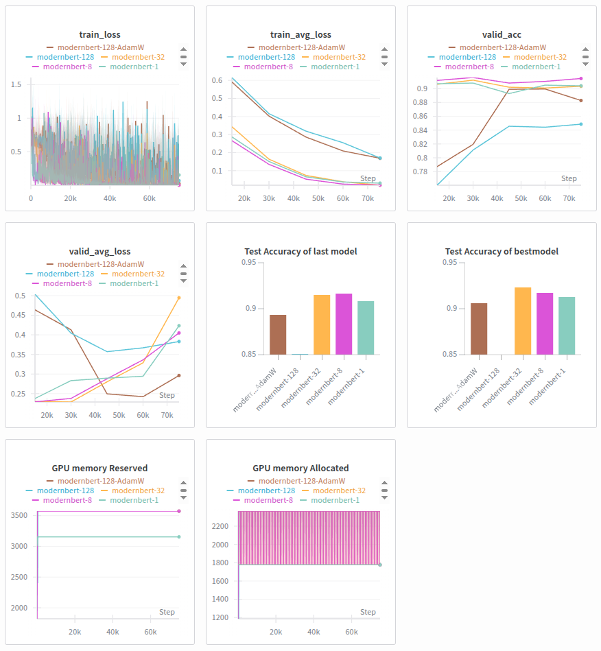

# DSBA-pretraining-NLP
This is DSBA pretraining NLP code.
This repository includes "bert-base-uncased" & "ModernBERT-base" training code on IMDB dataset

# Environments
- transformers==4.48.0
- Python==3.9.5
- torch==2.6.0+cu124

# Caution
1. Follow the installation in Huggingface document. (virtual env, torch, python version)

# Results
1. Moderbert-8/32 achieve the best performance
2. Increasing batch size with gradient accumulation (1024) achieves the lowest performance due to the overfitting
3. Moderbert-128 with AdamW (wd=0.001) improves the moderbert-128 with Adam optimizer
4. Based the GPU memory reservation, the gradient accumulation increases the memory usage whereas it doesn't depend on the gradient accumulation step size.

1. Gradient Accumulation with accelerator results

